# AdventureWorks2019 Data Analysis Insights and Trends for Business Decision Making.

 
Photo by Shawn Powar on Unsplash
## Introduction

This project explores a sample database called **AdventureWorks2019** developed by Microsoft that represents a fictional company called *AdventureWorks Cycles*, which sells bicycles and related products. The database is widely used by both experts and beginners for learning and practicing SQL.

The database contains tables related to the following areas:

- **Sales & Customers** (e.g., `Sales.SalesOrderHeader`, `Sales.Customer`)
- **Products & Production** (e.g., `Production.Product`, `Production.ProductCategory`)
- **Human Resources** (e.g., `HumanResources.Employee`, `HumanResources.Department`)
- **Finance & Accounting** (e.g., `Person.Person`, `Person.Address`)

### Primary Objectives:

- Customer Behavior Analysis  
- Sales Performance Analysis  
- Product and Inventory Insights  
- Advanced Business Insights

By diving into these objectives, we aim to gain valuable insights into consumer behavior, product performance, and sales trends. These insights will help inform better corporate strategies and decision-making.

The following sections will present our analysis, recommendations, and conclusion.

---

## Skills Demonstrated
*Tool: SSMS (SQL Server Management Studio)*
- **SQL Querying & Data Extraction**
- **Data Analysis**
- **Business Insight & Interpretation**
- **Data Visualization (via Excel)**

---

## Objectives:
## 1. Customer Behavior Analysis

### 1.1 Retrieve the top 10 customers by total purchase amount

```sql
SELECT TOP 10
    c.CustomerID,
    p.FirstName + ' ' + p.LastName AS CustomerName,
    ROUND(SUM(TotalDue), 2) AS TotalPurchaseAmount
FROM Sales.SalesOrderHeader soh
JOIN Sales.Customer c ON soh.CustomerID = c.CustomerID
JOIN Person.Person p ON c.PersonID = p.BusinessEntityID
GROUP BY c.CustomerID, p.FirstName, p.LastName
ORDER BY TotalPurchaseAmount DESC;
```


**Observation:** The analysis of the top **10** customers by total purchase amount reveals a critical segment of high-value individuals who significantly drive revenue. Leading the group is **Roger Harui** with the highest expenditure of **$989,184.08**, closely followed by several others like **Andrew Dixon**, **Reuben D'sa**, **Ryan Calafato**, and **Robert Vessa**, each contributing over **$900,000**. This concentration of spending among a few customers underscores their importance to the business's financial performance.

**Recommendation:** Nurturing relationships with these key accounts is crucial for sustained revenue and growth.

### 1.2 Identify customers with repeat purchases of the same product

```sql
SELECT
    c.CustomerID,
    p.FirstName + ' ' + p.LastName AS Customer_Name,
    prod.ProductID,
    prod.Name AS ProductName,
    COUNT(DISTINCT soh.SalesOrderID) AS NumberOfOrders
FROM Sales.SalesOrderHeader soh
JOIN Sales.SalesOrderDetail sod ON soh.SalesOrderID = sod.SalesOrderID
JOIN Sales.Customer c ON soh.CustomerID = c.CustomerID
JOIN Person.Person p ON c.PersonID = p.BusinessEntityID
JOIN Production.Product prod ON sod.ProductID = prod.ProductID
GROUP BY c.CustomerID, p.FirstName, p.LastName, prod.ProductID, prod.Name
HAVING COUNT(DISTINCT soh.SalesOrderID) >= 2
ORDER BY c.CustomerID, prod.ProductID;
```

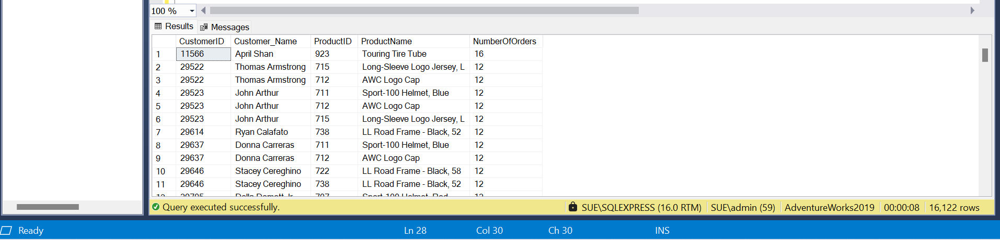

**Observation:** The query identified repeat customers, revealing that several individuals purchased the same product on multiple orders, indicating product loyalty. Notably, customers like **April Shan** (**Touring Tire Tube**, **16 orders**) and **Thomas Armstrong** (**Long-Sleeve Logo Jersey, L**, **12 orders**) show high repeat purchase frequency for specific items.

**Recommendation:** Understanding these repeat purchase patterns can inform strategies to enhance customer retention and drive further sales through personalized offers and relationship building.

### 1.3 List customers whose spending dropped by more than 30% year‑over‑year

```sql
WITH YearlySpending AS(
    SELECT
        c.CustomerID,
        p.FirstName,
        p.LastName,
        YEAR(soh.OrderDate) AS OrderYear,
        SUM(soh.TotalDue) AS TotalSpent,
        LAG(SUM(soh.TotalDue)) OVER (PARTITION BY c.CustomerID ORDER BY 
        YEAR(soh.OrderDate)) AS PreviousYearSpent
    FROM Sales.SalesOrderHeader soh
    JOIN Sales.Customer c ON soh.CustomerID = c.CustomerID
    JOIN Person.Person p ON c.PersonID = p.BusinessEntityID
    GROUP BY c.CustomerID, p.FirstName, p.LastName, YEAR(soh.OrderDate)
)
SELECT
    CustomerID,
    FirstName,
    LastName,
    OrderYear,
    TotalSpent,
    PreviousYearSpent,
    ROUND((PreviousYearSpent - TotalSpent) / NULLIF(PreviousYearSpent,0) * 100, 2) AS SpendingDropPercentage
FROM YearlySpending
WHERE (PreviousYearSpent - TotalSpent) / NULLIF(PreviousYearSpent, 0) > 0.3
ORDER BY SpendingDropPercentage DESC;
```

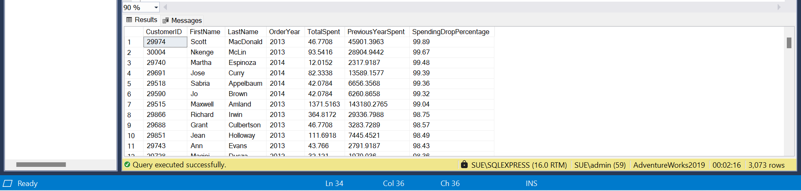

**Observation:** This pinpoints customers with a substantial reduction in their purchasing activity, signaling potential churn risk or decreased engagement. The results reveal several customers, such as **Scott MacDonald** (**99.89% drop** in **2013**) and **Nkenge McLin** (**99.67% drop** in **2013**), exhibiting near total cessation of spending.

**Recommendation:** This significant drop requires immediate investigation to understand the reasons behind the decreased spending and implement targeted re-engagement strategies to potentially win back these customers and mitigate further revenue loss.

### 1.4 Compute the average days between repeat purchases per customer

```sql
WITH CustomerOrderDates AS (
    SELECT
        CustomerID,
        OrderDate,
        LAG(OrderDate) OVER (PARTITION BY CustomerID ORDER BY OrderDate) AS PreviousOrderDate
    FROM Sales.SalesOrderHeader
),
DaysBetweenOrders AS (
    SELECT
        CustomerID,
        DATEDIFF(day, PreviousOrderDate, OrderDate) AS DaysBetween
    FROM CustomerOrderDates
    WHERE PreviousOrderDate IS NOT NULL -- Ignore first purchase
)
SELECT
    CustomerID,
    ROUND(AVG(DaysBetween * 1.0), 2) AS AvgDaysBetweenOrders
FROM DaysBetweenOrders
GROUP BY
  CustomerID
HAVING COUNT(*) >= 1 -- Ensure at least two purchases
ORDER BY CustomerID;
```

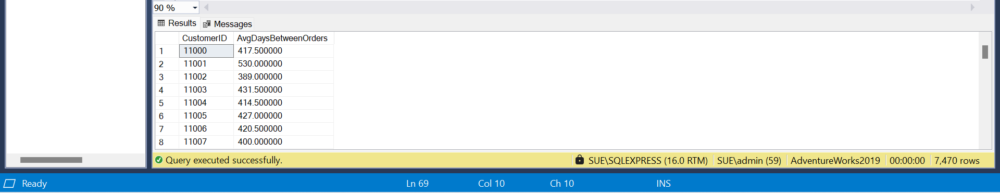

**Observation:** This metric provides insight into the purchasing frequency and loyalty of individual customers. A lower average indicates more frequent repeat purchases, suggesting higher engagement. The results show varying purchase frequencies, with customers with ID **11000** exhibiting the highest average of **417.5 days** between orders, while others like **11153**, **11638**, **12563**, **14981**, and **18215** show an average of **0 days**.

**Recommendation:** Understanding these patterns allows for targeted marketing efforts; customers with shorter intervals might be receptive to more frequent promotions, while those with longer intervals could benefit from strategies to encourage more frequent purchases and reduce potential churn.

### 1.5 Identify the top 5 most common product categories purchased

```sql
SELECT TOP 5
      pc.ProductCategoryID,
      pc.Name AS ProductCategory,
      COUNT(sod.SalesOrderID) AS TotalPurchases
FROM Sales.SalesOrderDetail AS sod
JOIN Production.Product AS prod ON sod.ProductID = prod.ProductID
JOIN Production.ProductSubcategory AS psc ON prod.ProductSubcategoryID = psc.ProductSubcategoryID
JOIN Production.ProductCategory AS pc ON pc.ProductCategoryID = psc.ProductCategoryID
GROUP BY pc.ProductCategoryID,
         pc.Name
ORDER BY TotalPurchases DESC;
```


**Observation:** This reveals the most popular product segments among the customer base, indicating areas of high demand. The results show that **"Accessories"** is the most purchased category with **41,194** total purchases, followed by **"Bikes"** (**40,031**), **"Clothing"** (**21,394**), and **"Components"** (**18,698**).

**Recommendation:** Focusing on these high-demand categories in inventory management, marketing campaigns, and product development strategies can optimize sales and cater to the majority of customer preferences in the market. Ensuring sufficient stock and potentially expanding offerings within these popular categories could further capitalize on existing demand.

## 2. Sales Performance Analysis

### 2.1 Calculate total monthly sales revenue over the past three years

```sql
WITH DateRange AS(
    SELECT DATEADD(YEAR, -3, MAX(OrderDate)) AS StartDate
    FROM Sales.SalesOrderHeader
)
    SELECT
        DATENAME(MONTH, OrderDate) AS OrderMonth,
        DATENAME(YEAR, OrderDate) AS OrderYear,
        SUM(TotalDue) AS MonthlySales_Revenue
FROM Sales.SalesOrderHeader soh
JOIN DateRange dr ON soh.OrderDate >= dr.StartDate
GROUP BY DATENAME(YEAR, OrderDate), DATENAME(MONTH, OrderDate)
ORDER BY MonthlySales_Revenue DESC;
```


**Observation:** This provides a historical trend of sales performance, highlighting seasonal patterns and overall revenue generation on a monthly basis. The results show monthly sales figures for **2011**, **2012**, **2013**, and **2014**, with **March 2014** exhibiting the highest revenue at **$8M**.

**Recommendation:** Analyzing these trends can inform forecasting, resource allocation, and targeted sales strategies for specific months. Understanding peak and low-performing months allows for proactive planning to maximize revenue during high seasons and potentially implement promotions or initiatives to boost sales during slower periods in the market.

### 2.2 Identify the most profitable products by total revenue

```sql
SELECT TOP 10
    p.ProductID,
    p.Name,
    SUM(sod.LineTotal) AS Total_Revenue
FROM Production.Product AS p
JOIN Sales.SalesOrderDetail AS sod ON p.ProductID = sod.ProductID
JOIN Sales.SalesOrderHeader AS soh ON sod.SalesOrderID = soh.SalesOrderID
GROUP BY p.ProductID, p.Name
ORDER BY Total_Revenue DESC;
```


**Observation:** This highlights the most financially successful products, indicating key drivers of profitability. The results reveal that **Mountain-200**, **Road-250**, and **Road-150** are the top **10** leading revenue generating models. **"Mountain-200 Black, 38"** is the top revenue generator with **$4,400,592.80**, followed by other **"Mountain-200 Black, 42"** (**$4,009,494.76**), and **"Mountain-200 Silver, 38"** (**$3,693,678.03**) bikes.

**Recommendation:** Prioritizing these high-revenue products in inventory, marketing efforts, and sales strategies is crucial for maximizing profitability. Understanding the characteristics of these top performers can also inform future product development and promotional activities.

### 2.3 Determine the top 5 sales representatives by revenue generated

```sql
SELECT TOP 5
    sp.BusinessEntityID,
    p.FirstName,
    p.LastName,
    SUM(soh.TotalDue) as Total_revenue
FROM Sales.SalesPerson AS sp
JOIN Person.Person AS p ON sp.BusinessEntityID = p.BusinessEntityID
JOIN Sales.SalesOrderHeader AS soh ON soh.SalesPersonID = sp.BusinessEntityID
GROUP BY sp.BusinessEntityID,
    p.FirstName,
    p.LastName
ORDER BY Total_revenue DESC;
```


**Observation:** This highlights the most successful sales personnel in terms of revenue generation, indicating top performers within the sales team. The results show **Linda Mitchell** as the leading sales representative with a total revenue of **$12M**, followed by **Jillian Carson ($11M)** , **Michael Blythe ($10M)**, **Jae Pak ($10M)**, and **Tsvi Reiter ($8M)**.

**Recommendation:** Recognizing and potentially rewarding these top performers can boost morale and provide successful models for the rest of the sales team. Analyzing their strategies and approaches could also yield valuable insights for improving overall sales effectiveness.

### 2.4 Calculate year‑over‑year sales growth rate

```sql
WITH YearlySales AS(
    SELECT
        YEAR(OrderDate) AS OrderYear,
        SUM(TotalDue) AS CurrentYearSales,
        LAG(SUM(TotalDue)) OVER(ORDER BY YEAR(OrderDate)) AS PreviousYearSales
FROM Sales.SalesOrderHeader
GROUP BY YEAR(OrderDate)
)
SELECT
    OrderYear,
    CurrentYearSales,
    PreviousYearSales,
    ((CurrentYearSales - PreviousYearSales) / NULLIF(PreviousYearSales, 0) * 100) AS YOYGrowthPercentage
FROM YearlySales
ORDER BY OrderYear;
```

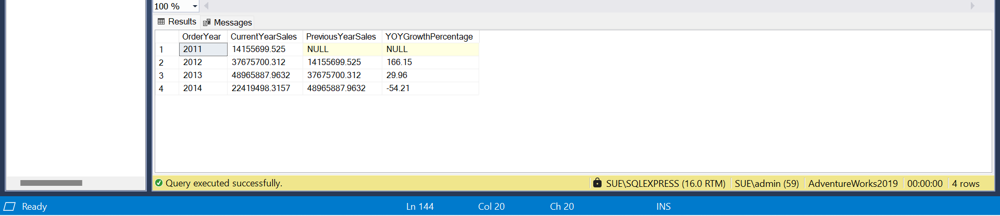

**Observation:** This metric reveals the percentage change in sales revenue compared to the previous year, indicating the direction and magnitude of sales growth or decline. The results show a significant growth of **166.15%** in **2012** compared to **2011**, followed by a **29.06%** growth in **2013**. However, **2014** experienced a sales decline of **54.21%** compared to **2013**.

**Recommendation:** The substantial growth in **2012** and **2013** suggests successful strategies or favorable market conditions during those periods. The sharp decline in **2014** warrants a thorough investigation to identify the contributing factors and implement corrective actions to regain growth momentum.

### 2.5 Identify the top 5 regions by revenue generated

```sql
SELECT TOP 5
    st.[Group] AS Region,
    SUM(soh.TotalDue) AS TotalRevenue
FROM Sales.SalesTerritory AS st
JOIN Sales.SalesOrderHeader AS soh ON st.TerritoryID = soh.TerritoryID
GROUP BY st.[Group]
ORDER BY TotalRevenue DESC;
```


**Observation:** This highlights the geographical areas where the company's sales are strongest, indicating key markets. The results show that **North America** is the top revenue-generating region (**72.42%**) with **$89M**, followed by **Europe** (**18.00%**), **$22M** and the **Pacific region** (**9.59%**), **$11M**.

**Recommendation:** Given that **North America** significantly outperforms other regions in revenue generation, resource allocation, and marketing efforts might be most effective when concentrated in this area. However, understanding the dynamics and potential for growth in **Europe** and the **Pacific region** could also inform strategic decisions for market expansion and investment.

## 3. Product and Inventory Insights

### 3.1 Identify products frequently purchased together

```sql
WITH PairedProducts AS (
    SELECT
        sod1.ProductID AS Product1ID,
        sod2.ProductID AS Product2ID
    FROM Sales.SalesOrderDetail sod1
    JOIN Sales.SalesOrderDetail sod2 ON sod1.SalesOrderID = sod2.SalesOrderID -- Same order
        AND sod1.ProductID < sod2.ProductID -- Avoid self-joins & duplicates (1, 2) and (2, 1) pairs
)
SELECT TOP 10
    p1.Name AS Product1,
    p2.Name AS Product2,
    COUNT(*) AS TimesPurchasedTogether
FROM PairedProducts pp
JOIN Production.Product p1 ON pp.Product1ID = p1.ProductID
JOIN Production.Product p2 ON pp.Product2ID = p2.ProductID
GROUP BY p1.Name, p2.Name
ORDER BY TimesPurchasedTogether DESC;
```

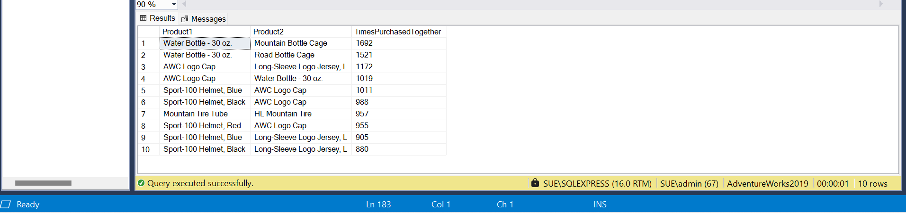

**Observation:** This reveals product affinities, indicating items that customers commonly buy simultaneously, suggesting potential complementary needs. The results show that **"Water Bottle - 30 oz."** and **"Mountain Bottle Cage"** are the most frequently purchased together (**1692 times**), followed by **"Water Bottle - 30 oz."** and **"Road Bottle Cage"** (**1521 times**).

**Recommendation:** Understanding these co-purchase patterns can inform strategies like product bundling, cross-selling recommendations during the checkout process, and targeted marketing campaigns that promote related items together. This can enhance the customer shopping experience and potentially increase the average order value.

### 3.2 Find the best selling product in each category

```sql
WITH ProductSales AS(
    SELECT
        p.Name AS ProductName,
        pc.Name AS CategoryName,
        SUM(sod.LineTotal) AS Total_revenue
FROM Sales.SalesOrderHeader AS soh
JOIN Sales.SalesOrderDetail AS sod ON soh.SalesOrderID = sod.SalesOrderID
JOIN Production.Product AS p ON p.ProductID = sod.ProductID
JOIN Production.ProductSubcategory AS psc ON p.ProductSubcategoryID = psc.ProductSubcategoryID
JOIN Production.ProductCategory AS pc ON psc.ProductCategoryID = pc.ProductCategoryID
GROUP BY sod.ProductID, p.Name, pc.Name
),
RankedProducts AS(
    SELECT
        CategoryName,
        ProductName,
        Total_Revenue,
        RANK() OVER (PARTITION BY CategoryName ORDER BY Total_Revenue DESC) AS rnk
    FROM ProductSales
)
SELECT
    CategoryName,
    ProductName,
    Total_Revenue
FROM RankedProducts
WHERE rnk = 1;
```

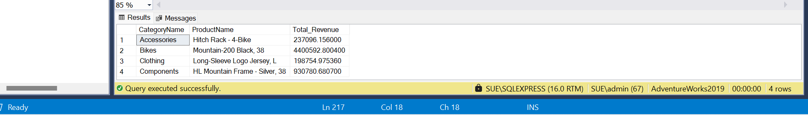

**Observation:** This highlights the top-performing product within different segments of the product catalog, revealing category leaders in terms of revenue generation in the market. The results show **"Hitch Rack - 4-Bike"** (**Accessories**) with **$237,096.16** revenue, **"Mountain-200 Black, 38"** (**Bikes**) with **$4,400,592.80**, **"Long-Sleeve Logo Jersey, L"** (**Clothing**) with **$198,754.96**, and **"HL Mountain Frame - Silver, 38"** (**Components**) with **$930,780.68**.

**Recommendation:** Understanding the top products in each category allows for focused marketing and inventory strategies. Emphasizing these bestsellers in promotions and ensuring adequate stock levels can capitalize on existing demand. Analyzing the characteristics of these leading products can also inform decisions about product development and line extensions

---

### 3.3 Retrieve products that have never been sold

```sql
SELECT
    prod.ProductID,
    prod.Name
FROM Production.Product AS prod
LEFT JOIN Sales.SalesOrderDetail AS sod ON prod.ProductID = sod.ProductID
WHERE sod.ProductID IS NULL;
```

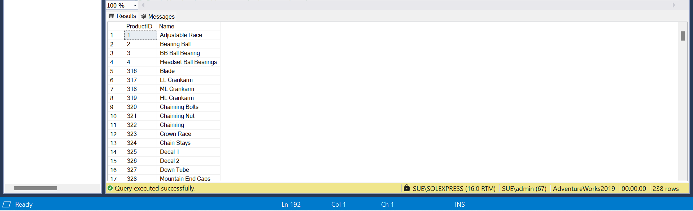

**Observation:** This highlights items in the product catalog that have not generated any sales, indicating potential issues with demand, marketing, or product relevance in the market. The results list **238** products that have never been sold, including items like **"Adjustable Race," "Bearing Ball,"** and various components.

**Recommendation:** The significant number of never sold products warrants a review of these items. This could involve assessing their market fit in Various Regions, evaluating past marketing efforts, considering product retirement, or exploring new strategies to generate demand. Addressing these non-performing products can optimize inventory and resource allocation.

### 3.4 Identify the most cancelled products

```sql
SELECT TOP 10
    p.ProductID,
    p.Name AS ProductName,
    SUM(sod.OrderQty) AS TotalCancelledQuantity,
    COUNT(DISTINCT soh.SalesOrderID) AS TotalCancelledOrders
FROM Sales.SalesOrderHeader soh
JOIN Sales.SalesOrderDetail sod ON soh.SalesOrderID = sod.SalesOrderID
JOIN Production.Product p ON sod.ProductID = p.ProductID
WHERE soh.Status = 6 -- 6 = Cancelled
GROUP BY p.ProductID, p.Name
ORDER BY TotalCancelledQuantity DESC;
```

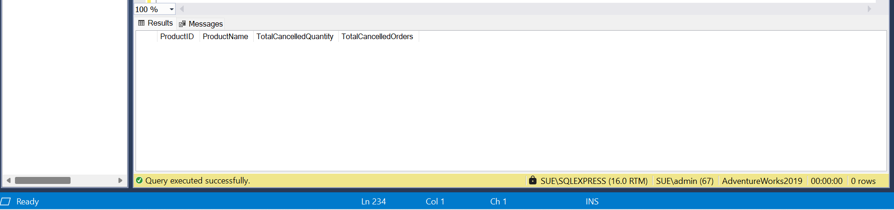

**Observation:** This highlights the products with the highest cancellation rates, indicating potential issues. The results show **no cancelled orders** in the provided dataset.

**Recommendation:** With no cancellations reported, current processes might be effective in fulfilling orders.

### 3.5 Find products with high order quantities but low total revenue

```sql
SELECT
    sod.ProductID,
    p.Name,
    SUM(OrderQty) AS Total_OrderQuantity,
    SUM(LineTotal) AS total_revenue
FROM Sales.SalesOrderDetail AS sod
JOIN Production.Product AS p ON sod.ProductID = p.ProductID
GROUP BY sod.ProductID, p.Name
ORDER BY Total_OrderQuantity DESC, total_revenue ASC;
```

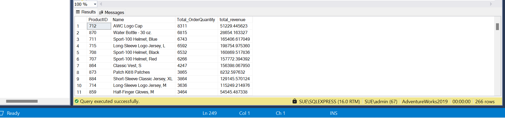

**Observation:** This highlights products that are frequently ordered in large numbers but generate relatively little income, potentially due to low unit prices or high discounts in the market. The results show **"AW Logo Cap"** with the highest total order quantity (**8311**) but a relatively low total revenue of **$51,229.45**. Similarly, **"Water Bottle - 30 oz."** has a high order quantity (**6815**) with a revenue of **$28,654.16**.

**Recommendation:** Investigating these products could reveal opportunities to optimize pricing strategies, reduce discounts, or explore upselling/cross-selling alongside these frequently ordered but low-revenue items to improve overall profitability.

## 4. Advanced Business Insights

### 4.1 Calculate the monthly sales growth rate

```sql
WITH MonthlySales AS(
    SELECT
        FORMAT(OrderDate, 'yyyy-MM') AS Month,
        SUM(TotalDue) AS CurrentMonthlySales,
        LAG(SUM(TotalDue)) OVER(ORDER BY FORMAT(OrderDate, 'yyyy-MM')) AS PreviousMonthlySales
    FROM Sales.SalesOrderHeader
    GROUP BY FORMAT(OrderDate, 'yyyy-MM')
)
SELECT
    Month,
    CurrentMonthlySales,
    PreviousMonthlySales,
    ((CurrentMonthlySales - PreviousMonthlySales)/ NULLIF(PreviousMonthlySales, 0))* 100 AS MonthlyGrowthRate
FROM MonthlySales
ORDER BY Month;
```

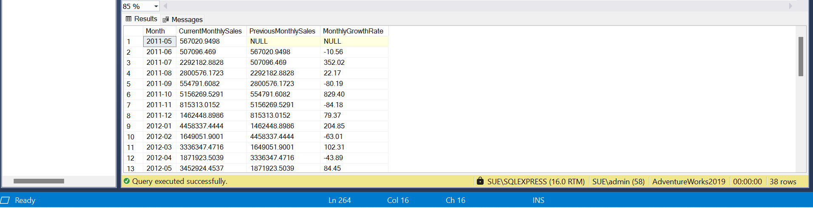

**Observation:** This reveals the percentage change in sales revenue month over month, highlighting trends in sales performance within shorter timeframes in the market. The results show fluctuating monthly growth rates, with significant increases in some months (e.g., **October 2011** at **829.40%**) and decreases in others (e.g., **November 2011** at **-84.18%**).

**Recommendation:** Analyzing these monthly fluctuations can inform short term sales strategies, help identify seasonal peaks and troughs, and allow for more agile responses to changing market conditions or the effectiveness of promotional activities on a monthly basis.

### 4.2 Compute a 3‑month moving average revenue per sales representative

```sql
WITH MonthlyRevenue AS(
    SELECT
        SalesPersonID,
        FORMAT(OrderDate, 'yyyy-MM') AS OrderMonth,
        SUM(TotalDue) AS MonthlyRevenue
    FROM Sales.SalesOrderHeader
    WHERE SalesPersonID IS NOT NULL
    GROUP BY  SalesPersonID, FORMAT(OrderDate, 'yyyy-MM')
)
SELECT
    SalesPersonID,
    OrderMonth,
    MonthlyRevenue,
    AVG(MonthlyRevenue) OVER(PARTITION BY SalesPersonID ORDER BY OrderMonth
                                    ROWS BETWEEN 2 PRECEDING AND CURRENT ROW) AS ThreeMonthMovingAvg
FROM MonthlyRevenue
ORDER BY SalesPersonID, OrderMonth, ThreeMonthMovingAvg DESC;
```

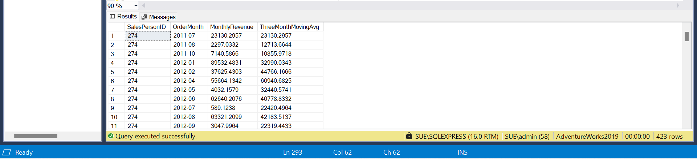

**Observation:** This smooths out short-term fluctuations in sales revenue, providing a clearer trend of individual sales performance over time for sales representatives. The results show the monthly revenue for each Sales Person along with their **3-month moving average** revenue.

**Recommendation:** This metric helps identify consistently high or low performing sales representatives, that help to evaluate individual contributions and implement targeted coaching or incentive programs. It also provides a more stable view of sales trends, less susceptible to single month anomalies.

### 4.3 Detect customers with significant spending declines over time

```sql
WITH CustomerMonthlySpending AS (
    SELECT
        CustomerID, FORMAT(OrderDate, 'yyyy-MM') AS OrderMonth, SUM(TotalDue) AS CurrentMonthSpend
    FROM Sales.SalesOrderHeader
    GROUP BY CustomerID, FORMAT(OrderDate, 'yyyy-MM')
),
SpendingDecline AS (
    SELECT
        CustomerID, OrderMonth, CurrentMonthSpend,
        LAG(CurrentMonthSpend) OVER(PARTITION BY CustomerID ORDER BY OrderMonth) AS PreviousMonthSpend,
        (LAG(CurrentMonthSpend) OVER(PARTITION BY CustomerID ORDER BY OrderMonth) - CurrentMonthSpend) AS DeclineAmount,
        ((LAG(CurrentMonthSpend) OVER(PARTITION BY CustomerID ORDER BY OrderMonth) - CurrentMonthSpend) / NULLIF(LAG(CurrentMonthSpend) OVER(PARTITION BY CustomerID ORDER BY OrderMonth), 0)) * 100 AS DeclinePercentage
    FROM CustomerMonthlySpending
)
SELECT
    CustomerID, OrderMonth, CurrentMonthSpend, PreviousMonthSpend, DeclineAmount, DeclinePercentage
FROM SpendingDecline
WHERE DeclineAmount > 0  -- Only select months where spending declined
ORDER BY DeclinePercentage DESC;
```


**Observation:** This pinpoints customers with a substantial negative trend in their purchasing behavior, indicating a high risk of churn. The results show customers with ID **29787** has **99.95%** the highest decline in spending, and **29974** with a **99.89%** decrease, highlighting a severe reduction in their purchase amounts over time.

**Recommendation:** These customers require immediate attention to understand the reasons for their decreased spending and implement targeted retention strategies to attempt to recover their business and mitigate further revenue loss.

## Conclusion
- This analysis of the AdventureWorks2019 database provides comprehensive observations on customer behavior, sales performance, product dynamics, and advanced trends. 
- Key recommendations include targeted loyalty programs, promotional strategies aligned with seasonality, inventory prioritization for top categories, and proactive customer re‑engagement. By implementing these data‑driven insights, AdventureWorks Cycles can optimize operations, enhance customer satisfaction, and drive sustainable growth.
